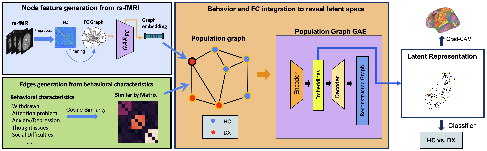

# A Novel GNN Framework Integrating Neuroimaging and Behavioral Information to Understand Adolescent Psychiatric Disorders

This repository contains the implementation for our paper submitted to **MIDL 2025**, titled:

**"A Novel GNN Framework Integrating Neuroimaging and Behavioral Information to Understand Adolescent Psychiatric Disorders"**

---

## 🔄 Framework Overview



---

## 🔧 Getting Started

### ▶️ To apply the framework:

1. Run `data.py` to prepare the dataset.
2. Then sequentially execute the following scripts:
   - `c1_code/c1_train.py`
   - `c1_code/c1_main.py`
   - `c3_code/c2_main.py`
   - `c3_code/c3_main.py`
   - `c3_code/c3_final_embeddings.py`

These steps will preprocess the data, train the model, and generate the final embeddings.

---

### 🧠 To check Grad-CAM results:

Simply run:

```bash
python Grad_CAM_main.py


If you use this code or find it helpful, please cite:
@inproceedings{yu2025novel,
  title={A Novel GNN Framework Integrating Neuroimaging and Behavioral Information to Understand Adolescent Psychiatric Disorders},
  author={Yu, Weifeng and Qu, Gang and Kim, Young-geun and Xu, Lei and Zhang, Aiying},
  booktitle={Medical Imaging with Deep Learning},
  year={2025}
}
